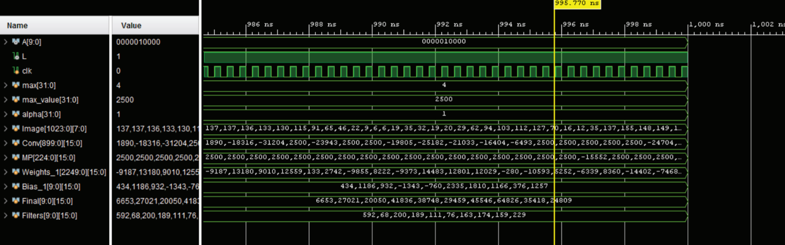

# ES-203 Computer Oraganization & Architecture CNN on FPGA board
## Overview
[Readme document](https://github.com/akcgjc007/ES203-COA-CNN/blob/main/CNN_ReadMe.pdf)

## Video Demostration
[Computer Organization & Architecture CNN Machine learning project on FPGA board | ES 203 Project
](https://youtu.be/3J2X-j0z2M8)

## Vivado files
 - []()
 - []()
 - []()

## Tips for LUT Optimization
Here, I am mentionaing some methods for converting your C type `for-loops` into efficient `always` blocks with chaining one to another

### 1: How to convert a for loop into verilog always block
```
// C code
for(int i = 0; i<n; i++)
{
	operations and functions
}
```

> Same process implementing using always block using a flag
```
integer i = 0, flag = 0;
...code
{ flag = 1; }	// when required
always@(posedge clock)
if(flag)
begin
		if(i==n) flag = 0;
		else
	begin
		operations and functions
		i = i+1;
	end
end
```

### 2: How to convert Nested for-looping into verilog always block
```
// C code
for(int i = 0; i<m; i++)
{
		for(int j = 0; j<n; j++)
		{
			operations and functions;
		}
}
```
> Same process implementing using always block using a flag
```
integer i, j, flag;
{ flag = 1; }	// when required
always@(posedge clock)
if(flag)
begin
 if(i == 0 && j == 0)
	begin
 	Outer Loop initialization statements
		operations and functions;
	end
	else if( i == m )
	begin
		flag = 0;	// process completed
	end
	else if( j == n )
	begin 
		j = 0;	// intitialization statements analogous to inner for-loop 
		i = i+1; // updation statement of outer for loop
		operations and functions;
	end
	else
	begin
		operations and functions;
		j = j+1;
	end
end
```

## Outputs on FPGA board


## Presentation poster


## Contributors
<table>
  <tr>
    <td align="center">
      <a href="https://github.com/Lovepreet-Singh-LPSK">
          
          <br />
          <sub><b>Lovepreet Singh</b></sub>
      </a>
    </td>    
    <td align="center">
      <a href="https://github.com/akcgjc007">
          
          <br />
          <sub><b>Anupam Kumar</b></sub>
      </a>
    </td>
	<td align="center">
      <a href="">
          
          <br />
          <sub><b>Jayesh Salunkhe</b></sub>
      </a>
    </td>
    <td align="center">
      <a href="">
          
          <br />
          <sub><b>Unnat Dave</b></sub>
      </a>
    </td>
  </tr>
</table>